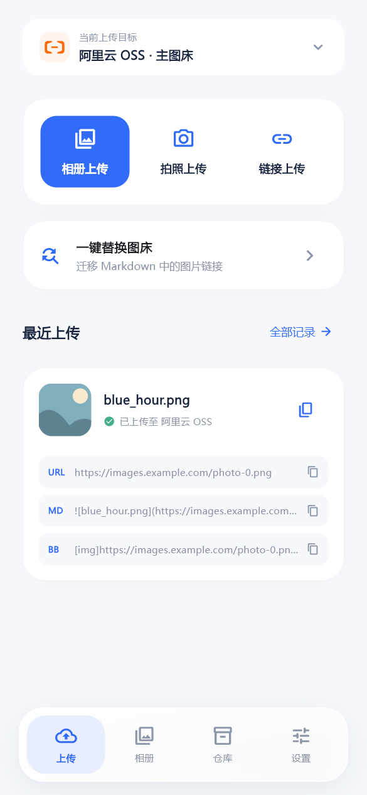
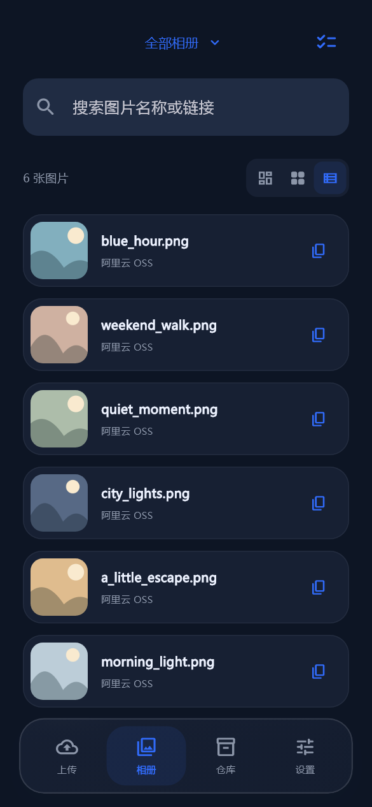
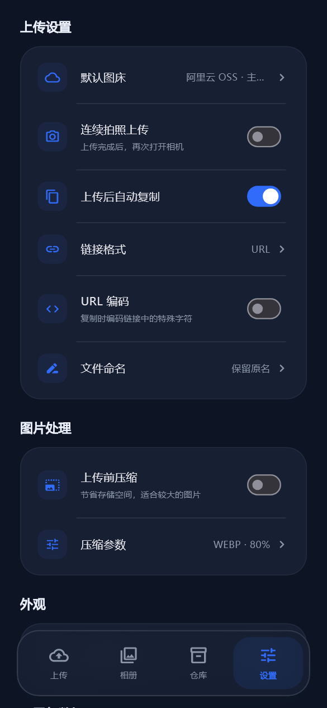

<div align="center">
  
  <h1>Picora</h1>
  <p>Android 上的快捷图床与对象存储聚合客户端</p>
  <p><strong>独立版本 1.0.0 · 基于 PicHoro v3.0.1 · MIT License</strong></p>
</div>

Picora 是从 PicHero 派生的独立开源项目，以 PC 应用 PicGo 的使用方式为参考：选择上传目标、上传图片、复制链接、管理记录。它保留 PicHoro 的上传与存储能力，重新设计 Android 界面，并提供可扩展的图床插件。

[使用与安装](#使用与安装) · [插件开放说明](插件开放说明.md) · [开发](#开发) · [贡献](CONTRIBUTING.md) · [更新日志](Version_update_log.md)

## 功能

| 页面 | 能力 |
| --- | --- |
| 上传 | 相册/文件、拍照、图片 URL、批量上传、系统分享、失败重试；切换当前上传目标 |
| 相册 | 瀑布流、网格、列表；按图床配置筛选；搜索、详情、多选、批量复制和删除 |
| 仓库 | 图床列表；同一图床类型创建多个独立配置；默认上传目标；云端文件管理入口 |
| 设置 | 浅色 / 自动 / 深色主题；上传偏好、图片处理、文件命名、配置导入导出、诊断日志 |

- **快捷复制**：URL、Markdown、Discuz / BBCode 链接，上传页展示最近一条记录。
- **一键替换图床**：选择 Markdown 文件和目标配置，下载文档图片并重新上传，覆盖或另存输出；失败链接保留，提供失败详情。
- **自定义文件名**：日期、年份、MD5、SHA-256、UUID 等可点击变量。
- **插件中心**：本地 ZIP / 下载 URL 安装、同 ID 覆盖、启用/停用、导出、作者与源码信息、离线教程、资源图标。

## 界面预览

下图来自界面测试预览，使用示例配置与图片；并非真实上传或真机测试凭据。

<p align="center">
  
  
  
  
</p>

## 图床与存储服务

已有连接器包括阿里云 OSS、腾讯云 COS、七牛云、又拍云、S3 兼容存储、GitHub、SM.MS、Imgur、兰空图床、OpenList、WebDAV、FTP / SFTP，以及自定义 Web 图床和 PicGo Bridge。服务可用性、接口限制和认证方式由对应服务决定，上传账号和密钥由用户自行提供。

同一图床类型可以添加多组配置，例如在 S3 类型下分别创建 Amazon、Backblaze 或备用桶，在上传页直接切换。

## 使用与安装

当前维护目标为 **Android ARM64（arm64-v8a）**，最低 **Android 7.0 / API 24**。包名为 `io.github.alnitak44.picora`；暂不承诺 iOS 可用。

1. 在项目的 [GitHub Releases](https://github.com/Alnitak44/Picora/releases) 查看维护者实际发布的 APK；源码版本号不代表对应安装包已经发布。
2. 安装后进入“仓库”，添加图床类型并填写配置，可设为默认目标。
3. 回到“上传”，选择相册、拍照或图片链接，完成上传后复制所需格式的链接。

源码版本为 **1.0.0**，版本从此独立维护。Debug 包显示 `1.0.0-debug`；本机旧安装包可能仍显示 `3.0.1-debug`，应以 APK 的内部信息为准。

Picora 与旧应用的包名不同，可以独立安装。迁移时先在旧应用导出配置，再导入 Picora；插件配置需要先安装对应插件。Debug / Release 使用同一包名，签名不同的包不能直接覆盖安装。

详细说明：[真机验收](docs/DEVICE_TESTING.md) · [Markdown 迁移与文件命名](docs/MARKDOWN_MIGRATION.md)。

## 插件

原生插件在 Android 上独立运行，当前使用 `http-v1` 声明式 HTTP 协议：

```text
example.picora-plugin.zip
├── plugin.json       # ID、名称、版本、作者、主页、图标与程序入口
├── readme.md         # 面向用户的介绍和使用教程
├── uploader.json     # HTTP 上传/删除与配置表单
└── assets/           # 图标、教程图片、静态资源
```

- 从“仓库 → 插件中心”安装 ZIP 或填写下载 URL，再在图床列表添加配置。
- PicGo 的 npm / JavaScript 插件不能直接导入；可通过 **PicGo Bridge** 连接电脑或 NAS 上的 PicGo Server。
- 在线插件目录、GitHub 插件列表和自动检查更新仍在规划中，当前不提供在线市场。

[插件开放说明](插件开放说明.md) · [完整协议](docs/PLUGINS.md) · [空白模板](plugins/template) · [Telegraph-Image 示例](plugins/telegraph-image) · [在线生态方案](docs/PLUGIN_MARKETPLACE.md)。

## 开发

使用锁定的工具链：**Flutter 3.35.7 / Dart 3.9.2、JDK 21、Android SDK 36、Build Tools 35.0.0、NDK 27.0.12077973、Gradle 8.10.2**。保留 `pubspec.lock` 和 `android/vendor/` 中的兼容补丁。

新克隆的工程需要自行安装 SDK；源码仓库不包含本机 `.tooling/`。在已有 Flutter 和 Git 的环境中：

```powershell
flutter pub get --enforce-lockfile
flutter analyze --no-pub lib/hero lib/main.dart test
flutter test --no-pub
```

以上命令串行执行，上一条失败时先解决再继续。首次没有缓存时不能使用 `--offline`。Android 构建还需 Java 与 Android SDK；不要用 `flutter create .` 重建现有工程。

ARM64 Debug 构建命令：

```powershell
flutter build apk --debug --no-pub --target-platform android-arm64 --split-per-abi
```

Flutter 的产物目录为 `build/app/outputs/flutter-apk/`。本机便携环境可用 `scripts/build-debug.ps1`，交付文件复制到 `releases/Picora-arm64-debug.apk`。Release 需要自行配置 `android/key.properties` 和发布 keystore。

[打包说明](打包说明.md)包含本机路径、7890 代理、中文路径处理、版本码、签名和常见问题。环境恢复记录仅代表维护者本机的历史状态，不是其他电脑的固定安装路径。

## 目录

```text
lib/                     Flutter 业务、上传 API、云端管理
  hero/                  四页界面、控制器、插件与诊断
android/                 Android 工程及 vendor 兼容补丁
assets/                  应用图标、服务图标、字体与示例插件
plugins/                 插件模板与 Telegraph-Image 源码
test/                    页面、控制器、插件和 Markdown 测试
docs/                    使用、开发、设计与验收文档
scripts/                 本机环境及 ARM64 构建脚本
tools/                   插件打包、源码导出等辅助工具
.github/                 Issue / PR 模板
```

文档入口见 [docs/README.md](docs/README.md)；上传 GitHub 前的操作说明见 [GitHub 发布准备](docs/GITHUB_PUBLISH.md)。

## 来源与许可证

Picora 基于 **PicHoro v3.0.1**，经 PicHero 派生，继承的基础提交为 `07f356e410ecbc62cbaf7ffc99326b0df7dd3eb0`。感谢 [Kuingsmile/PicHoro](https://github.com/Kuingsmile/PicHoro)、PicHoro 贡献者和 PicGo 社区。[上游 README](docs/UPSTREAM_README.md)与历史更新记录予以保留；其版本和发布地址不代表 Picora 当前状态。

项目代码以 [MIT License](LICENSE) 开源，保留上游版权并增加 Picora 修改部分的版权声明：

```text
Copyright (c) 2022-present, Kuingsmile
Copyright (c) 2026 Alnitak44 and Picora contributors
```

分发时保留适用版权声明与完整许可文本；具体授权和免责条款以 LICENSE 为准。第三方库与外部素材遵循各自许可证，见 [第三方声明](THIRD_PARTY_NOTICES.md)。
